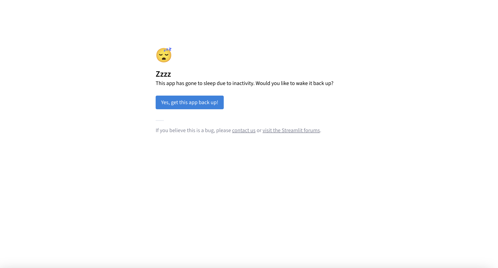
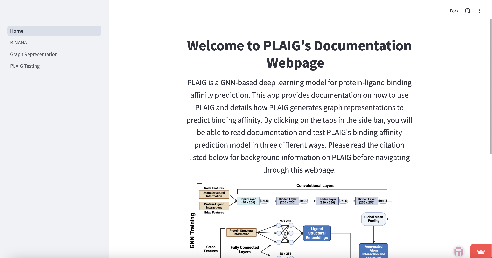
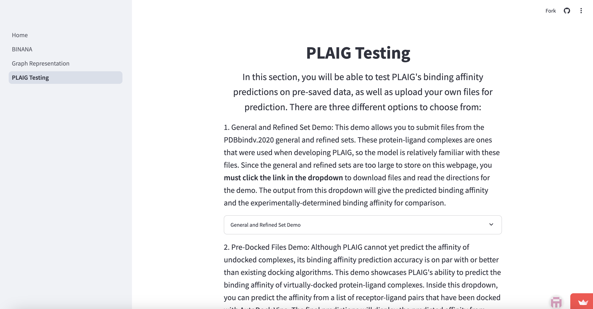

# PLAIG
## Accessing the PLAIG Demo Webpage
Welcome to the GitHub repository for PLAIG: <u>**P**</u>rotein-<u>**L**</u>igand Binding <u>**A**</u>ffinity Prediction 
using a Novel <u>**I**</u>nteraction-Based <u>**G**</u>raph Neural Network Framework. PLAIG can predict the binding 
affinity for protein-ligand complexes. **Please do not download this repository** if you want to test PLAIG's 
protein-ligand binding affinity prediction capabilities. 

Instead, please click on the link in the **About section to access additional documentation and the demo program**. 
The link will take you to the webpage which we created using the Streamlit package.

When you click on the link, you may see this page:

In order to access the webpage, please click on the blue "Yes, get this app back up!" button. You will then have to wait
a couple of minutes for the webpage to fully wake up so you can access the demo.

Once you see this page:

You will then be able to navigate through the tabs on the side panel to read further information about PLAIG or use or 
demo program. The "BINANA" tab delves deeper into our implementation of extracting important possible protein-ligand 
interactions with the binana pythin module. The "Graph Representation" tab gives you additional information about 
how we created the graphs for our Graph Neural Network-based deep learning framework. 

This is what the "PLAIG Testing" page looks like when you navigate to the proper tab.

Users can test PLAIG with their own protein-ligand complex files or download example files from the 
"Refined_General_Files" directory in this repository. In-depth directions about using the demo found in the proper 
webpage tabs. 

## Repository File and Folder Dictionary

Below is what each file and folder in this directory contains (please ignore .png files):

- "Refined_General_Files": Directions and a link for downloading the PDBbind v.2020 protein-ligand complexes we used 
for training and testing PLAIG. These files will also work when testing out the demo webpage.
- "binana": The modified binana python module we used to extract potential protein-ligand interactions for this study
- "pages": Contains files for the PLAIG webpage using Streamlit
- "GNN_Model8.pth": File for storing the trained GNN used for demo predictions
- "Home.py": Streamlit-based file for webpage homepage
- "PLAIG_Architecture.py": Code for PLAIG's base GNN
- "PLAIG_Run.py": Central code to predict protein-ligand complexes
- "PLAIG_Stacking_compress.joblib": File for storing trained stacking regressor for demo predictions
- "combined_drugs_2_normalization_statistics.pkl" and "combined_set_normalization_statistics.pkl": Storage files for 
  normalizing the protein and ligand attributes used in our deep learning model
- "graph_representation.py": Code for coverting .pdb and .pdbqt files to graphs. Graphs are then used in PLAIG's 
  GNN-based deep learning model

